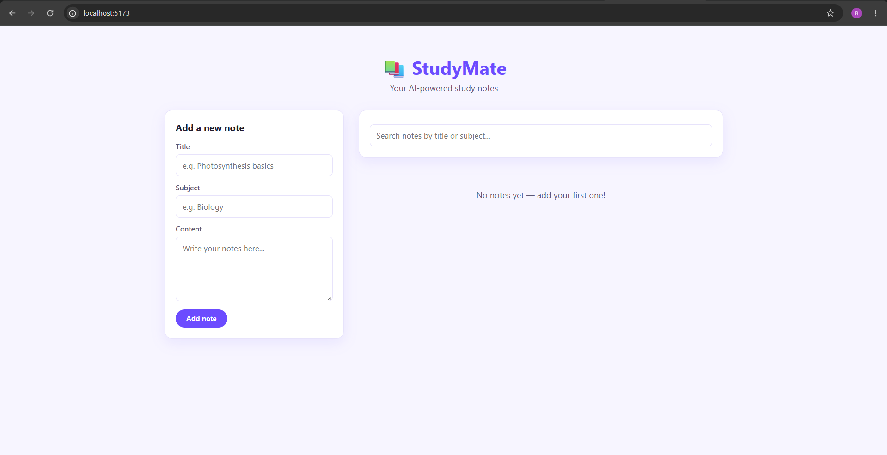
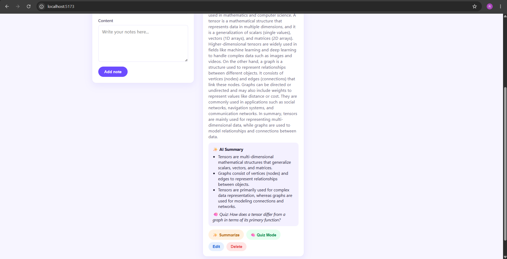
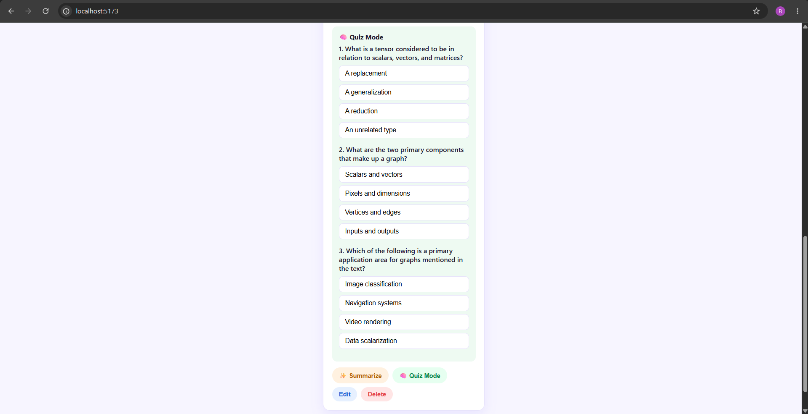
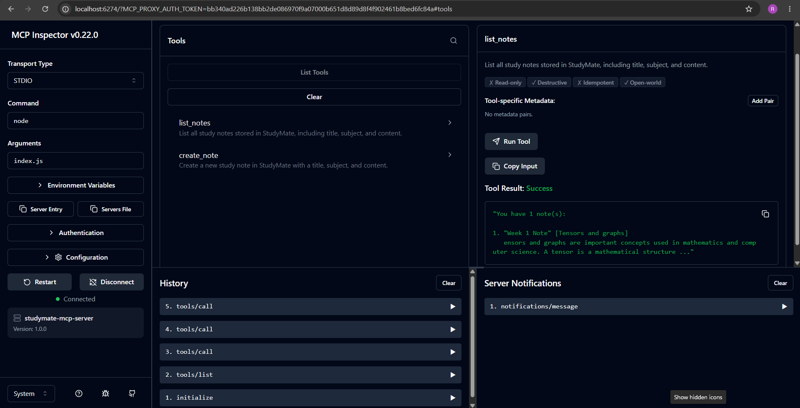
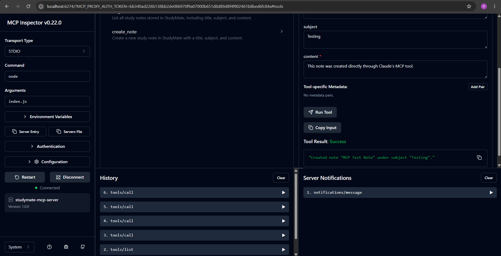

# 📚 StudyMate - AI-Powered Study Notes App

StudyMate is a full-stack study notes app: capture notes by subject, get an AI-generated
3-bullet summary + quiz question for any note, and manage everything through a custom MCP
server tested with MCP Inspector.

## Tech stack

| Layer | Tech |
|---|---|
| Landing page | HTML5, CSS3 (Flexbox/Grid, CSS variables, dark mode), vanilla JS |
| Frontend | React 18 + Vite |
| Backend | Node.js, Express |
| Database | MongoDB + Mongoose |
| AI | Anthropic Claude API (`@anthropic-ai/sdk`) |
| Claude integration | Model Context Protocol (MCP) server over stdio |

## Repo structure

```
studymate/
├── landing/            # Part 1 — pure HTML/CSS/JS marketing page
│   ├── index.html
│   ├── style.css
│   └── script.js
├── client/              # Part 2 — React app (Vite)
│   └── src/
│       ├── App.jsx
│       ├── api.js
│       └── components/
│           ├── NoteForm.jsx
│           ├── NoteCard.jsx
│           └── SearchBar.jsx
├── server/              # Parts 3 & 4 — Express + MongoDB + AI
│   ├── server.js
│   ├── models/Note.js
│   ├── routes/notes.js
│   └── .env.example
├── mcp-server/          # Part 5 — MCP server
│   ├── index.js
│   └── package.json
└── README.md            # Part 6
```

---

## 1. Landing page

Pure HTML/CSS/JS — no build step needed.

```bash
cd landing
# just open index.html in browser, or serve it:
npx serve .
```

Features: hero with a typing-effect pitch, 3 feature cards (CSS Grid/Flexbox), an FAQ
accordion, and a persisted dark-mode toggle. Responsive under 768px.

---

## 2. React client

```bash
cd client
npm install
npm run dev
```

Runs at `http://localhost:5173`. By default it calls the API at
`http://localhost:5000/api` — override with a `.env` file containing
`VITE_API_URL=http://localhost:5000/api` if your server runs elsewhere.

Features: fetches notes on load (`useEffect`), add/edit note form (controlled
components), delete, client-side search filtering by title/subject, loading and
empty states, and a "✨ Summarize" button per note with its own loading state.

---

## 3 & 4. Server (Express + MongoDB + AI)

```bash
cd server
cp .env.example .env   # then fill in MONGODB_URI and ANTHROPIC_API_KEY
npm install
npm start
```

Runs at `http://localhost:5000`.

### `.env.example` explained

| Variable | Purpose |
|---|---|
| `PORT` | Port Express listens on (default `5000`) |
| `MONGODB_URI` | Local (`mongodb://127.0.0.1:27017/studymate`) or Atlas connection string. **URL-encode** any special characters in your Atlas password, and allow `0.0.0.0/0` in Atlas's IP access list for local dev. |
| `ANTHROPIC_API_KEY` | Your key from [console.anthropic.com](https://console.anthropic.com/), used by the `/summarize` endpoint |

### Routes

| Method | Route | Description |
|---|---|---|
| GET | `/api/notes` | List all notes, newest first |
| POST | `/api/notes` | Create a note (`title`, `subject`, `content`) — `400` if title/content empty |
| PUT | `/api/notes/:id` | Update a note (bonus) |
| DELETE | `/api/notes/:id` | Delete a note |
| POST | `/api/notes/:id/summarize` | Send note content to Claude, get back 3 bullets + 1 quiz question, save on the note |

CORS is enabled so the Vite dev server can call the API without issues.

---

## 5. MCP server

```bash
cd mcp-server
npm install
```

Exposes two tools over stdio:

- **`list_notes`** — fetches `GET /api/notes` from the Express API and summarizes them
- **`create_note`** — posts to `POST /api/notes` to add a new note (`title`, `subject`, `content`)

### Testing with MCP Inspector

Make sure the Express server (Part 3) is running first, since the MCP tools call it over HTTP.

```bash
cd mcp-server
npx @modelcontextprotocol/inspector node index.js
```

This opens MCP Inspector in your browser at `http://localhost:6274`, pre-configured with
`node` as the command and `index.js` as the argument.

1. Click **Connect**
2. Click **List Tools** — you should see `list_notes` and `create_note`
3. Select a tool, fill in any required inputs, and click **Run Tool**

Screenshots of both tools succeeding are in the Screenshots section below.
---

## Screenshots

### App UI


### AI Summarize in action


### AI Quiz Mode (bonus)


### MCP Inspector — list_notes tool call


### MCP Inspector — create_note tool call


---

## Bonus features implemented

- ✅ Edit/update note end-to-end (`PUT /api/notes/:id`, edit button + form pre-fill in React)
- ✅ Dark mode toggle on the landing page (persisted via `localStorage`)
- ✅ AI quiz mode (3 MCQs)
- ✅ AI Summarize with 3 points
- ⬜ Deployment — not implemented in this pass

## Notes for the reviewer

- The AI summarize and quiz endpoints call Google's `gemini-3.1-flash-lite` model via
  plain `fetch` (no SDK dependency needed), and expect strict JSON back, which is then
  persisted onto the note document so it survives a page refresh.
- MongoDB runs locally (not Atlas) to avoid a TLS/SSL handshake issue encountered with
  Atlas on this network — the app works identically against either.
- MCP tools were tested and proven using MCP Inspector rather than Claude Desktop —
  screenshots show successful `list_notes` and `create_note` calls end-to-end
  (MCP → Express API → MongoDB).
- Validation on `POST`/`PUT /api/notes` returns `400` with a JSON `{ error }` body when
  `title` or `content` is empty/whitespace-only.
